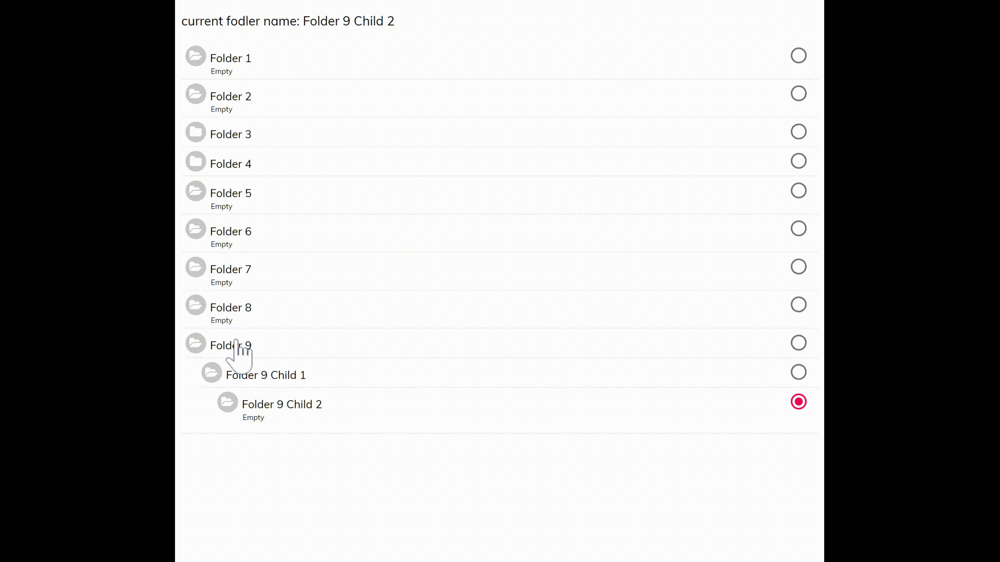

## To install

```sh
npm install react-redux-folders-tree
```

Alternatively you may use `yarn`:

```sh
yarn add react-redux-folders-tree
```

## To Run

```js
import React, { Component } from "react";
import FoldersTree from "./Components/Main/FoldersTree/FoldersTree";

class App extends Component {
  constructor(props) {
    super(props);

    this.applySelected = this.applySelected.bind(this);

    this.state = {
      allFolders: YOUR DATA
    };
  }

  applySelected(selected) {
    this.setState({
      ...this.state,
      currentFodler: selected
    });
  }

  render() {
    return (
      <React.Fragment>
        <div className="App">
          <FoldersTree onFolderSelect={this.applySelected} data={this.state.allFolders} />
        </div>
      </React.Fragment>
    );
  }
}

export default App;
```

## Data Format:

```js
{
      token: "1f7f20dd10ce7836487bcc9fbbba4263eb22eb064ed2e930137f84fd275b348c",
      name: "Folder 1",
      folders: []
    },
```

## Sample Data:

```js
{
      token: "a2f32e1514fa2b7e6177fba786fc6158556fd01c92001959239fb6ac839ac52c",
      name: "Folder 1",
      folders: []
    },
    {
      token: "d3847453f093f49a0954189a6c2d7017a2f47d7e8cd515fcd4ec4512c15aede8",
      name: "Folder 2",
      folders: [
        {
          token: "71fa14b4b1f4a8ac6677fbbb0f3dbd8118cd448e420f4a93622c3d554d836e0a",
          name: "Folder 2 Child 1",
          folders: [
            {
              token: "991fa14b4b1f4a8ac6677fbbb0f3dbd8118cd448e420f4a93622c3d554d836e0a",
              name: "Folder 2 Child 2",
              folders: []
            }
          ]
        }
      ]
    }
```

## Sample Tree:




## Something Missing?

If you have ideas for more “How To” recipes that should be on this page, [let us know](https://github.com/bierx/react-redux-folders-tree/issues)
